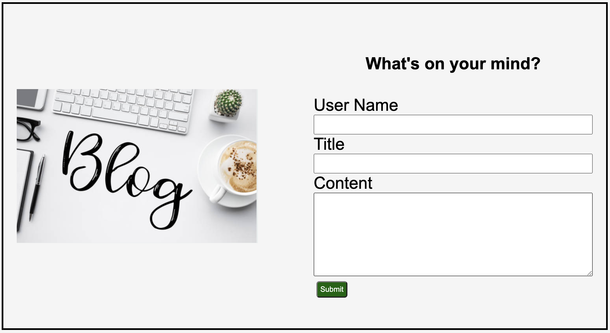

# My First blog

## Description

This blog page was created with the intentions of showcasing thoughts and experiences.
This personal blog was created with the purpose of learning to apply what I have learned about Javascript. It is very challenging in my opinion and creating this personal blog has helped me tremendously learn how to apply what I have learned from scratch. 
Buliding this personal blog has shown me how important Javascript is for all kinds of webpages and how it links it all together. 
I have learn a lot about what Javascipt does and how it works. I have much more to learn.

## Usage

Fill out the form and click submit. Once submitted, you will be re-directed to another page where you will be able to see your post!
You are able to change the them from white to gray to make it easy on your eyes if needed. Once you are on the "Shared Blogs" pages, there is also a back button if you need to go back to the form where you submit more entries. 

https://2023kgl.github.io/personal-blog/

https://github.com/2023kgl/personal-blog

    